# ETL/ELT 系统设计 - FustGo DataX

## 1. 概述

### 1.1 系统定位
FustGo DataX 是一个高性能、分布式的 ETL/ELT 数据同步系统，借鉴阿里巴巴 DataX 和 Benthos 的优秀设计理念，专注于异构数据源之间的无缝数据迁移和转换。系统采用声明式配置驱动的架构，支持可视化拖拽式配置界面，实现零编码的数据处理流程编排。

### 1.2 核心能力
- **多源数据接入**: 支持 20+ 种数据源类型（关系型数据库、NoSQL、时序数据库、OLTP/OLAP、消息队列、HTTP等）
- **声明式配置**: 借鉴 Benthos 的 YAML 配置驱动理念，通过配置文件定义完整数据流水线
- **可视化编排**: 图形化拖拽式界面，所见即所得的流水线设计体验
- **插件化架构**: 动态插件加载，支持自定义扩展
- **数据处理链**: 可组合的无状态处理步骤，支持过滤、转换、聚合、富化等操作
- **Web 管理控制台**: 配置管理、任务监控、问题分析、数据预览
- **分布式执行**: 水平扩展支持大规模数据传输
- **任务调度**: 基于 Cron 的调度和依赖管理
- **容错与恢复**: 自动重试和检查点机制

### 1.3 设计理念（借鉴 Benthos）

#### 声明式配置优先
- 所有数据流水线通过 YAML 配置文件定义
- 配置即代码，版本可控、易于审计
- 支持配置模板和变量替换
- 配置验证和热重载

#### 可组合的处理单元
- Input（输入）→ Pipeline（处理）→ Output（输出）三段式架构
- 处理器（Processor）可任意组合和链接
- 每个处理器职责单一，无状态设计
- 支持条件分支和并行处理

#### 配置可视化
- 将 YAML 配置转换为可视化流程图
- 拖拽式组件编排，自动生成配置
- 实时预览配置效果
- 双向同步：图形界面 ↔ YAML 配置

### 1.4 技术栈

#### 核心技术
- **开发语言**: Go 1.23+
- **Web 框架**: Gin（HTTP 路由和中间件）
- **前端框架**: React 18 + Ant Design 5.x
- **流程编排**: React Flow（可视化拖拽）
- **配置解析**: YAML/TOML 解析器
- **插件机制**: 静态编译（所有插件编译进主程序）

#### 存储层（可选配置）

**元数据存储**（支持多种后端）：
- **SQLite**（默认）: 单机部署、测试环境、小数据量场景
- **PostgreSQL**: 生产环境、大规模部署
- **MySQL**: 兼容性选择

**注意**: 元数据库仅存储元数据、配置、任务定义，不存储大量运行时数据

**缓存与队列**（可选）：
- **内存模式**（默认）: 无需 Redis，使用 Go 内置数据结构
- **Redis 模式**（可选）: 分布式部署、高可用场景

**任务分发**（自适应）：
- **内存队列**（默认）: 单机部署，使用 channel
- **NATS/RabbitMQ**（可选）: 分布式 Worker 节点

**监控与日志**：
- **OpenObserve**: 统一的指标和日志存储
- **本地日志**: 文件系统持久化日志

#### 运行环境
- **生产环境**: Linux（Docker Compose 部署）
- **开发环境**: macOS, Windows 11
- **容器化**: Docker + Docker Compose

### 1.5 部署模式

系统支持三种部署模式，可根据数据规模和资源情况选择：

| 部署模式 | 适用场景 | 组件部署 | 依赖 |
|---------|---------|---------|-----|
| **单机模式** | 测试、开发、小数据量（< 10万/天） | 所有组件同一进程 | 仅需 SQLite |
| **轻量模式** | 中小规模（10-100万/天） | 主服务 + 1-3 Worker | SQLite/PostgreSQL |
| **分布式模式** | 大规模生产（> 100万/天） | 分布式集群 | PostgreSQL + Redis + NATS |

## 2. 系统架构

### 2.1 整体架构概览

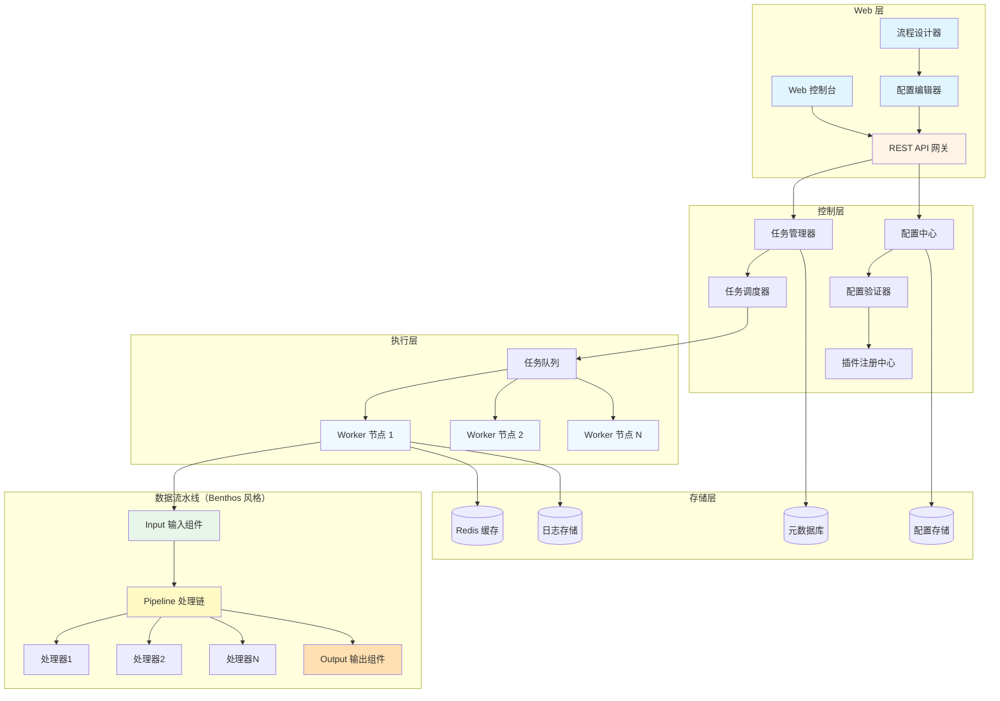

### 2.2 分层架构

| 层次 | 组件 | 职责 |
|------|------|------|
| **展现层** | Web 控制台、流程设计器、REST API | 用户界面、可视化配置、任务监控仪表板 |
| **服务层** | 任务管理器、调度器、插件注册中心、配置中心 | 业务逻辑、任务编排、插件生命周期管理 |
| **执行层** | Worker 池、任务队列 | 分布式任务执行、资源管理 |
| **流水线层** | Input、Pipeline、Output 组件 | 数据提取、转换、加载（Benthos 三段式） |
| **存储层** | 元数据库（SQLite/PostgreSQL）、缓存（内存/Redis）、日志 | 元数据持久化、配置存储、缓存 |

### 2.3 部署模式架构

#### 单机模式架构

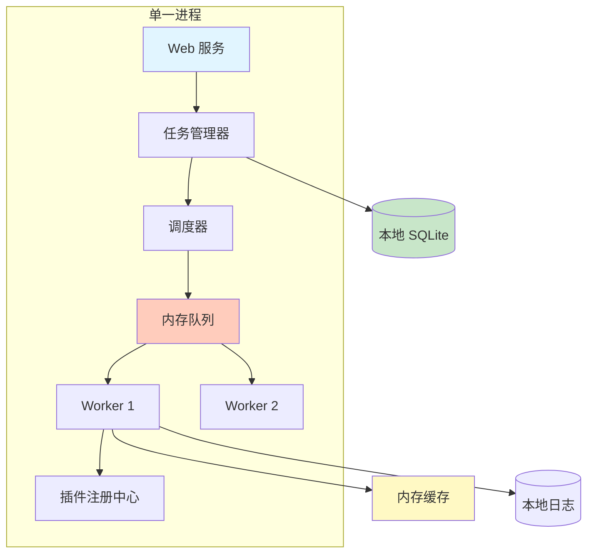

**特点**：
- 所有组件在同一进程内运行
- 使用 SQLite 存储元数据，无需外部数据库
- 使用 Go channel 作为内存队列
- 使用 sync.Map 作为内存缓存
- 无需 Redis、NATS 等外部依赖
- 单个可执行文件，开箱即用

#### 轻量模式架构

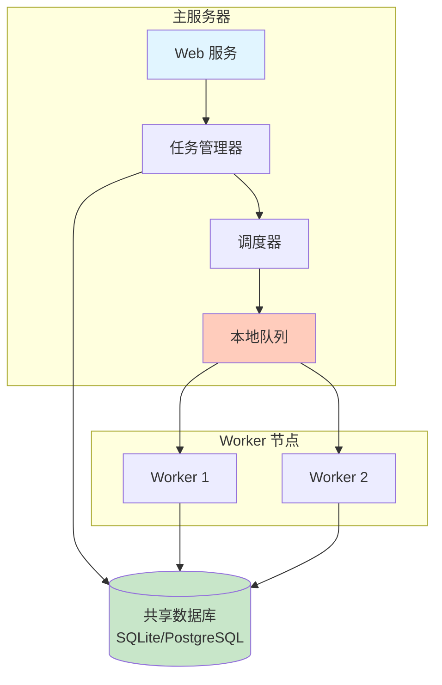

**特点**：
- 主服务器和 Worker 可同机或分机部署
- 使用共享数据库（SQLite 或 PostgreSQL）
- 基于数据库轮询的任务分发
- 可选配置 Redis 提升性能
- 无需消息队列中间件

#### 分布式模式架构

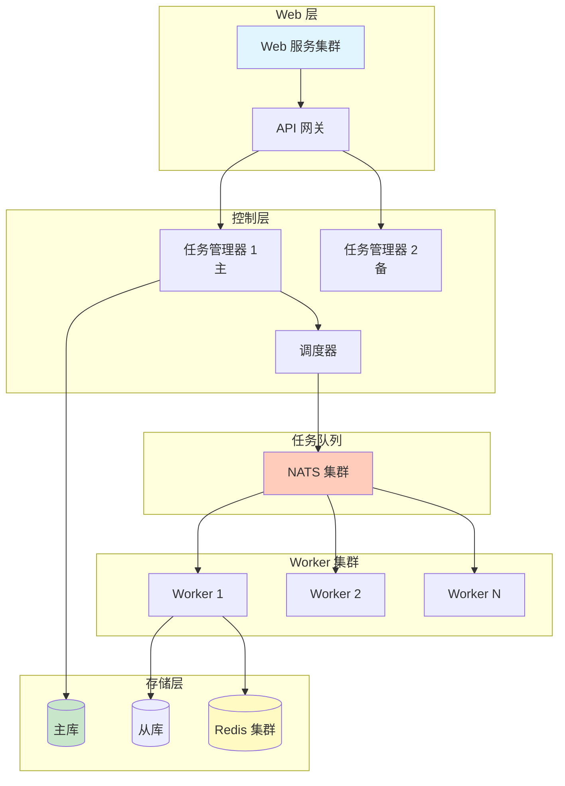

**特点**：
- 主备高可用架构
- 使用 PostgreSQL 主从复制
- Redis 集群用于缓存和分布式锁
- NATS 消息队列分发任务
- 水平扩展 Worker 节点

### 2.4 配置驱动的执行流程

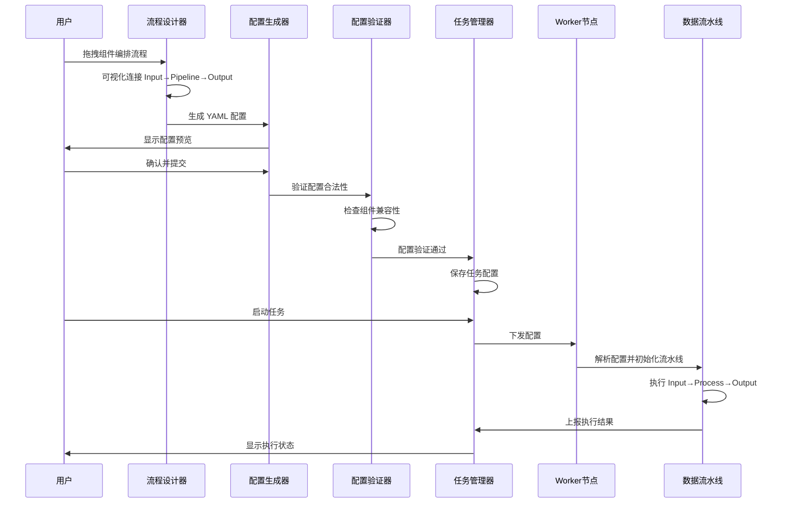

### 2.5 存储抽象层设计

#### 元数据存储接口

系统定义统一的元数据存储接口，支持多种后端：

| 接口方法 | 说明 |
|----------|------|
| Initialize(config) | 初始化数据库连接 |
| SaveJob(job) | 保存任务配置 |
| GetJob(jobID) | 获取任务配置 |
| ListJobs(filter) | 列出任务 |
| SaveExecution(exec) | 保存执行记录 |
| GetExecutions(jobID) | 获取执行历史 |
| SaveCheckpoint(cp) | 保存检查点 |
| GetCheckpoint(execID) | 获取检查点 |

**实现后端**：

1. **SQLiteMetadataStore**（默认）
   - 单文件数据库，随应用一起分发
   - 支持嵌入式模式，无需安装
   - 适合单机和小规模部署
   
2. **PostgreSQLMetadataStore**
   - 企业级数据库，支持高并发
   - 支持主从复制和读写分离
   - 适合生产环境

3. **MySQLMetadataStore**
   - 兼容性选择
   - 适合已有 MySQL 基础设施

#### 缓存抽象接口

| 接口方法 | 说明 |
|----------|------|
| Set(key, value, ttl) | 设置缓存 |
| Get(key) | 获取缓存 |
| Delete(key) | 删除缓存 |
| Exists(key) | 判断存在 |
| Lock(key, timeout) | 分布式锁 |
| Unlock(key) | 释放锁 |

**实现后端**：

1. **InMemoryCache**（默认）
   - 使用 sync.Map + TTL 管理
   - 无需外部依赖
   - 仅适用于单机模式
   
2. **RedisCache**（可选）
   - 支持分布式缓存
   - 支持分布式锁
   - 适合分布式部署

#### 任务队列抽象接口

| 接口方法 | 说明 |
|----------|------|
| Enqueue(task) | 入队 |
| Dequeue() | 出队 |
| Peek() | 查看队首 |
| Size() | 队列长度 |

**实现后端**：

1. **ChannelQueue**（默认）
   - 使用 Go channel
   - 适合单机模式
   
2. **DatabaseQueue**（轻量模式）
   - 基于数据库轮询
   - Worker 可分布在不同主机
   
3. **NATSQueue**（分布式模式）
   - 基于 NATS Streaming
   - 支持高吞吐量
   - 适合大规模部署

### 2.6 Benthos 风格的流水线架构

#### 三段式数据流

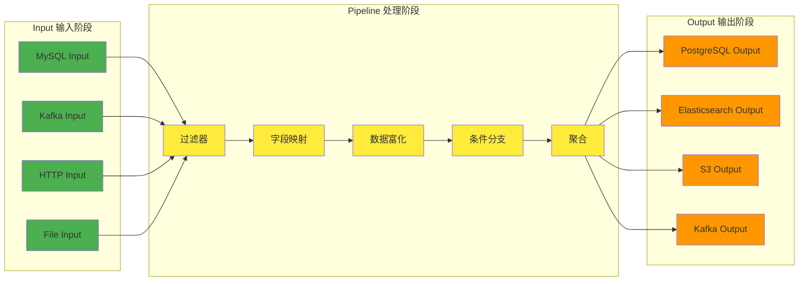


### 2.4 配置驱动的执行流程


## 3. 配置驱动设计（Benthos 理念）

### 3.1 YAML 配置结构

#### 配置模板示例

一个完整的数据同步任务配置示例：

**基本结构**：
- `input`: 定义数据源
- `pipeline`: 定义处理步骤链
- `output`: 定义目标输出

**MySQL 到 PostgreSQL 的配置示例**：

配置文件包含三个主要部分：

1. **input 部分**：定义 MySQL 数据源
   - type: mysql
   - connection: 连接参数（host, port, database, user, password）
   - query: 查询配置（table, columns, where, split_key）

2. **pipeline.processors 部分**：定义处理步骤
   - filter: 过滤数据
   - mapping: 字段映射和转换
   - enrichment: 数据富化

3. **output 部分**：定义 PostgreSQL 目标
   - type: postgresql
   - connection: 连接参数
   - write: 写入配置（mode, table, batch_size）

**Kafka 到 Elasticsearch 的配置示例**：

配置文件包含：

1. **input 部分**：Kafka 消费者
   - type: kafka
   - topics: 订阅话题列表
   - consumer_group: 消费者组
   - brokers: Kafka 代理地址列表

2. **pipeline.processors 部分**：
   - json_decode: 解析 JSON 消息
   - transform: 字段转换
   - timestamp_convert: 时间格式转换

3. **output 部分**：Elasticsearch 索引
   - type: elasticsearch
   - urls: ES 集群地址
   - index: 目标索引
   - id_field: 文档 ID 字段

### 3.2 配置组件分类

#### Input 组件类型

| 类别 | 组件类型 | 支持的数据源 |
|------|----------|----------------|
| **关系型数据库** | mysql, postgresql, sqlserver, oracle, mariadb, tidb | 各类 RDS 数据库 |
| **NoSQL** | mongodb, redis, cassandra, hbase, dynamodb | NoSQL 数据库 |
| **时序数据库** | influxdb, timescaledb, prometheus, opentsdb | 时序数据 |
| **OLAP** | clickhouse, greenplum, snowflake, bigquery | 分析型数据库 |
| **消息队列** | kafka, rabbitmq, nats, pulsar, rocketmq | 流式数据 |
| **对象存储** | s3, minio, oss, azure_blob, gcs | 文件存储 |
| **HTTP/API** | http, rest, graphql, websocket | API 接口 |
| **文件系统** | csv, json, parquet, avro, orc | 文件格式 |

#### Pipeline Processor 组件类型

| 处理器类型 | 功能描述 | 配置参数 |
|------------|----------|----------|
| **filter** | 根据条件过滤记录 | condition, mode |
| **mapping** | 字段映射和重命名 | field_mappings |
| **transform** | 数据类型转换 | transformations |
| **enrichment** | 数据富化（外部查询） | lookup_source, lookup_key |
| **aggregate** | 数据聚合 | group_by, aggregations |
| **split** | 将一条记录拆分为多条 | split_field |
| **merge** | 合并多条记录 | merge_key |
| **deduplicate** | 去重 | key_fields, time_window |
| **json_decode** | 解析 JSON 字符串 | source_field |
| **json_encode** | 将对象编码为 JSON | target_field |
| **regex_extract** | 正则表达式提取 | pattern, source_field |
| **date_format** | 日期时间格式化 | source_format, target_format |
| **conditional** | 条件分支 | conditions, branches |

#### Output 组件类型

| 类别 | 组件类型 | 支持的目标 |
|------|----------|----------------|
| **关系型数据库** | mysql, postgresql, sqlserver, oracle | 批量写入、Upsert |
| **NoSQL** | mongodb, redis, cassandra, hbase | 文档/键值写入 |
| **OLAP** | clickhouse, elasticsearch, snowflake | 批量导入 |
| **消息队列** | kafka, rabbitmq, nats, pulsar | 消息发送 |
| **对象存储** | s3, minio, oss | 文件写入 |
| **文件** | csv, json, parquet | 本地文件写入 |

### 3.3 配置验证机制

#### 验证级别

| 验证类型 | 验证内容 | 失败处理 |
|----------|----------|----------|
| **语法验证** | YAML 格式正确性 | 拒绝提交，显示错误位置 |
| **结构验证** | 必填字段、字段类型 | 高亮错误字段 |
| **语义验证** | 组件存在性、参数合法性 | 提示修正建议 |
| **兼容性验证** | Input/Output 类型匹配、Schema 兼容性 | 警告提示 |
| **连接测试** | 数据源连接性测试 | 可选项，建议执行 |

#### 验证流程

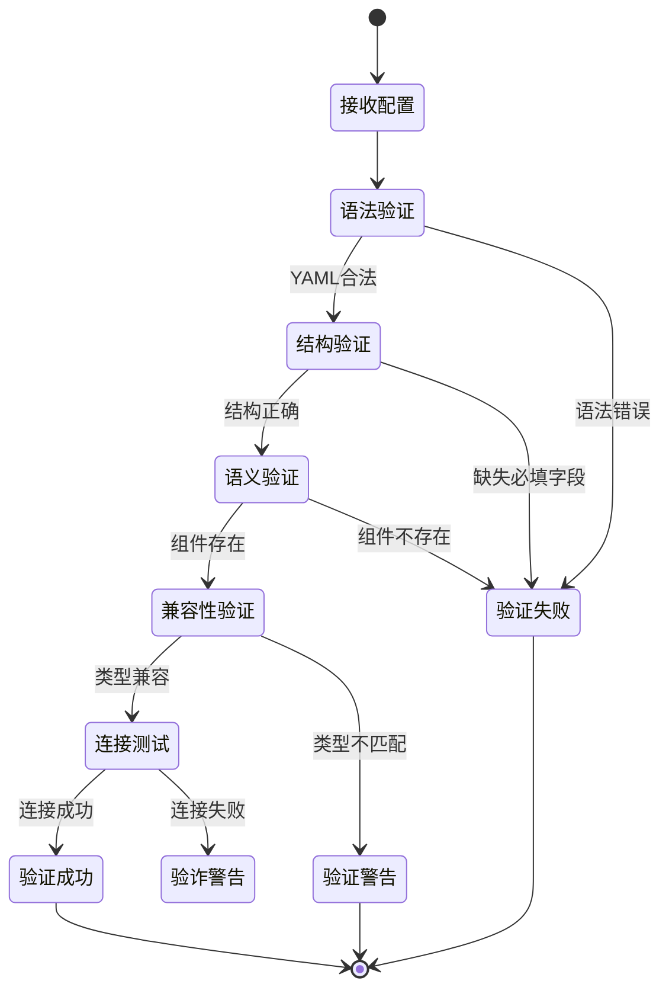

## 4. 可视化流程设计器

### 4.1 拖拽式界面设计

#### 组件面板

左侧组件库分类显示：

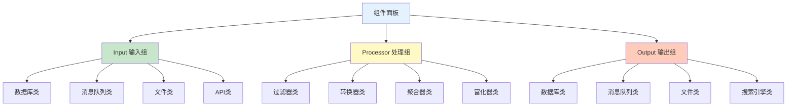

#### 画布区域

中间画布区功能：

| 功能 | 描述 | 交互方式 |
|------|------|---------|
| **组件拖放** | 从左侧组件面板拖拽组件到画布 | 鼠标拖拽 |
| **组件连接** | 连接线连接不同组件 | 点击连接点拖拽 |
| **组件配置** | 双击组件打开配置面板 | 双击/右键菜单 |
| **组件删除** | 删除选中的组件 | Delete 键/右键菜单 |
| **布局调整** | 自动布局/手动调整 | 工具栏按钮 |
| **缩放平移** | 画布缩放和平移 | 滚轮/拖拽背景 |
| **验证提示** | 实时验证并显示错误 | 组件边框高亮 |

#### 属性配置面板

右侧属性面板显示：

| 区域 | 显示内容 |
|------|----------|
| **组件基本信息** | 组件名称、类型、描述 |
| **连接配置** | host, port, database, username, password 等 |
| **查询配置** | table, columns, where, split_key 等 |
| **处理配置** | 过滤条件、映射规则、转换逻辑 |
| **性能配置** | batch_size, timeout, parallelism |
| **错误处理** | retry_policy, error_limit |

### 4.2 流程编排示例

#### 简单数据同步流程


用户操作步骤：
1. 拖拽 "MySQL" 组件到画布
2. 拖拽 "过滤器" 组件到画布
3. 拖拽 "字段映射" 组件到画布
4. 拖拽 "PostgreSQL" 组件到画布
5. 依次连接组件：MySQL → 过滤器 → 字段映射 → PostgreSQL
6. 配置每个组件的属性

#### 复杂分支流程

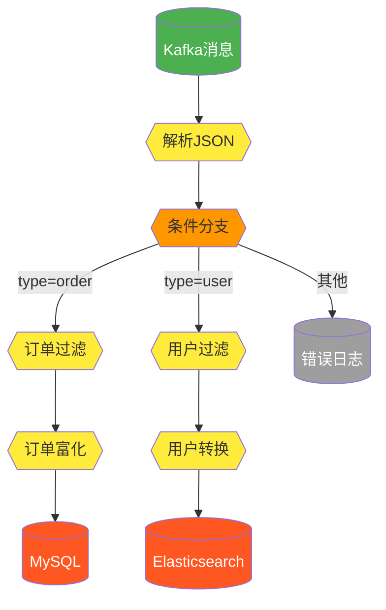

### 4.3 配置生成机制

#### 从图形到 YAML

流程设计器会将可视化流程转换为 YAML 配置：

**转换规则**：

| 图形元素 | YAML 映射 |
|----------|------------|
| Input 组件 | input 节点 |
| Processor 组件 | pipeline.processors 数组元素 |
| Output 组件 | output 节点 |
| 连接线 | 组件顺序关系 |
| 组件属性 | 组件配置参数 |

**生成流程**：

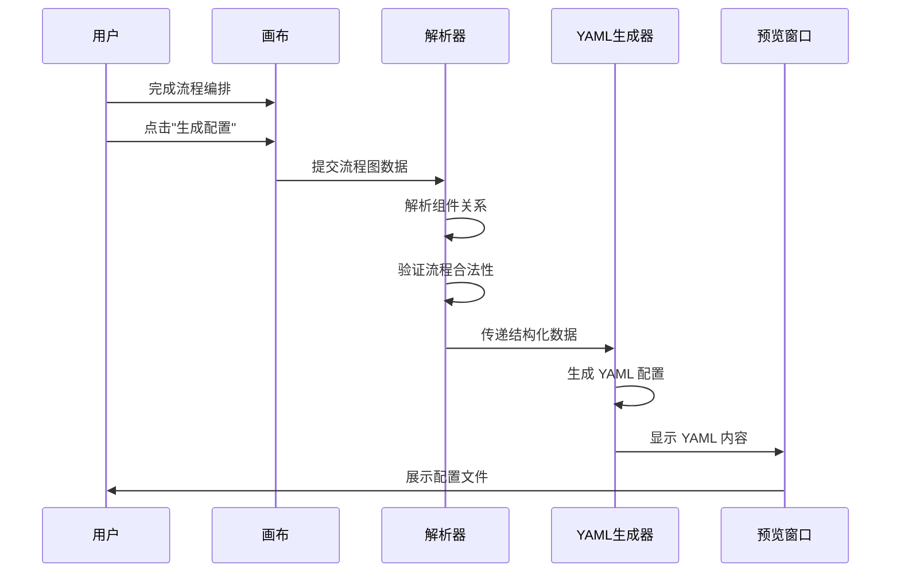

#### 从 YAML 到图形

系统也支持导入 YAML 配置并自动生成可视化流程图：

**解析流程**：

1. **读取 YAML**: 解析 YAML 文件结构
2. **创建组件**: 根据 input/pipeline/output 创建对应的图形组件
3. **建立连接**: 根据 processors 数组顺序建立连接线
4. **填充属性**: 将配置参数填充到组件属性面板
5. **布局优化**: 自动计算组件位置，生成美观的布局

### 4.4 实时验证与提示

#### 验证规则

| 验证类型 | 触发时机 | 提示方式 |
|----------|----------|----------|
| **组件连接** | 连接线创建时 | Input 只能连接到 Processor/Output |
| **必填字段** | 属性编辑时 | 红色边框标记未填字段 |
| **类型匹配** | 组件连接时 | 警告图标显示类型不匹配 |
| **数据流完整性** | 实时检测 | 孤立组件高亮显示 |
| **配置合法性** | 属性保存时 | 错误信息气泡提示 |

#### 视觉反馈

| 状态 | 视觉效果 |
|------|----------|
| **正常** | 绿色边框，组件可拖拽 |
| **警告** | 黄色边框，显示警告图标 |
| **错误** | 红色边框，显示错误图标 |
| **选中** | 蓝色边框高亮 |
| **拖拽中** | 半透明显示 |
| **连接中** | 虚线跟随鼠标 |

## 5. 核心组件设计

### 5.1 任务管理器

#### 职责
- 任务生命周期管理（创建、启动、暂停、停止、删除）
- 任务配置验证
- 任务执行历史追踪
- 资源分配协调

#### 任务状态机

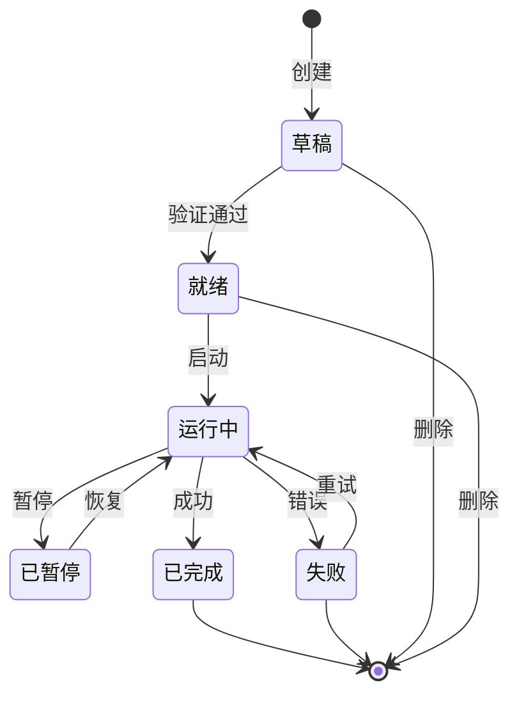

#### 任务配置模型

| 字段 | 类型 | 说明 | 必填 |
|------|------|------|------|
| job_id | String | 唯一任务标识 | 是 |
| job_name | String | 任务名称 | 是 |
| job_type | Enum | ETL 或 ELT 模式 | 是 |
| config_content | YAML | 完整的 YAML 配置内容 | 是 |
| flow_diagram | JSON | 可视化流程图数据 | 否 |
| scheduling | Object | Cron 表达式和时区 | 否 |
| enabled | Boolean | 启用/禁用标记 | 是 |
| priority | Integer | 任务优先级 | 否 |
| retry_policy | Object | 重试策略配置 | 否 |

### 5.2 配置解析引擎

#### 解析流程

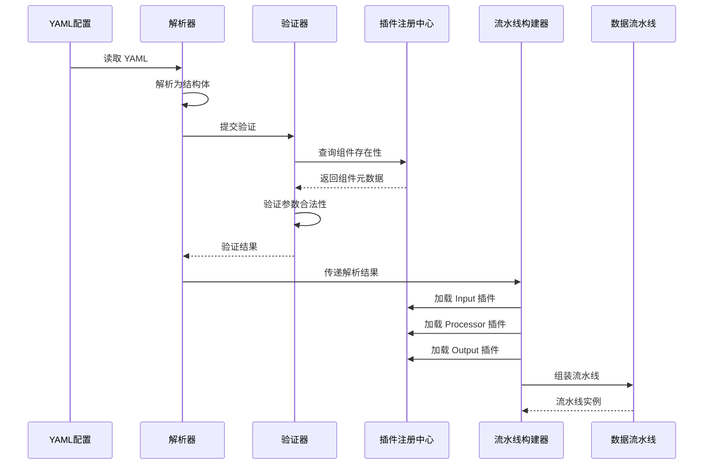

#### 解析器职责

| 功能 | 说明 |
|------|------|
| **YAML 解析** | 将 YAML 文本解析为 Go 结构体 |
| **变量替换** | 支持环境变量和模板变量替换 |
| **引用解析** | 支持配置文件引用和继承 |
| **错误定位** | 精准定位配置错误的行号和列号 |

### 5.3 插件系统（静态编译）

#### 设计理念

**放弃 Go Plugin 机制**：
- Go Plugin 需要相同的编译环境
- 版本管理复杂，依赖冲突难以解决
- 平台兼容性问题（Windows/macOS/Linux）
- 调试和排错困难

**采用静态编译方案**：
- 所有插件代码编译进主程序
- 通过配置文件启用/禁用插件
- 简化部署，单一二进制文件
- 避免运行时加载问题

#### 插件注册机制

**目录结构**：

项目结构示例：
- plugins/
  - input/
    - mysql/
      - mysql.go
      - config.go
    - kafka/
      - kafka.go
    - http/
      - http.go
  - processor/
    - filter/
    - transform/
    - enrichment/
  - output/
    - postgresql/
    - elasticsearch/
    - s3/
  - registry.go  # 插件注册中心

**注册中心实现**：

每个插件包必须实现 init() 函数，在程序启动时自动注册：

示例注册逻辑：
1. 定义全局 Registry 对象
2. 每个插件在 init() 中调用 Registry.Register()
3. 主程序启动时根据配置启用插件

#### 插件接口定义

**基础插件接口**

所有插件必须实现的方法：

| 方法 | 参数 | 返回值 | 说明 |
|------|------|---------|------|
| Name | - | string | 插件唯一名称 |
| Type | - | PluginType | 插件类型（Input/Processor/Output） |
| Initialize | config map[string]interface{} | error | 初始化插件 |
| Validate | - | error | 验证配置 |
| Close | - | error | 关闭插件，释放资源 |
| GetMetadata | - | PluginMetadata | 返回插件元数据 |

**Input 插件接口**（继承基础接口）

| 方法 | 参数 | 返回值 | 说明 |
|------|------|---------|------|
| Connect | - | error | 连接数据源 |
| ReadBatch | batchSize int | (DataBatch, error) | 读取一批数据 |
| HasNext | - | bool | 判断是否有更多数据 |
| GetProgress | - | Progress | 获取读取进度 |

**Processor 插件接口**（继承基础接口）

| 方法 | 参数 | 返回值 | 说明 |
|------|------|---------|------|
| Process | input DataBatch | (DataBatch, error) | 处理数据批次 |
| GetStatistics | - | ProcessStatistics | 获取处理统计 |

**Output 插件接口**（继承基础接口）

| 方法 | 参数 | 返回值 | 说明 |
|------|------|---------|------|
| Connect | - | error | 连接目标系统 |
| WriteBatch | data DataBatch | error | 写入一批数据 |
| Flush | - | error | 刷新缓冲区 |
| GetWriteStatistics | - | WriteStatistics | 获取写入统计 |

#### 插件配置管理

**主配置文件** (config.yaml)：

插件配置示例：

plugins:
  enabled:  # 启用的插件列表
    input:
      - mysql
      - postgresql
      - kafka
      - http
    processor:
      - filter
      - transform
      - enrichment
    output:
      - postgresql
      - elasticsearch
      - s3
  
  disabled:  # 禁用的插件列表
    input:
      - oracle  # 暂时不需要
    output:
      - snowflake  # 未授权

**启用/禁用机制**：

1. **编译时包含所有插件**：所有插件代码都编译进二进制
2. **运行时根据配置启用**：只初始化配置中 enabled 的插件
3. **动态启用**：可通过 API 动态启用/禁用插件（无需重启）
4. **Web 界面管理**：通过 UI 界面切换插件状态

#### 插件列表

**Input 插件**（内置）：

| 插件名 | 类型 | 说明 | 优先级 |
|---------|------|------|--------|
| mysql | RDB | MySQL/MariaDB | P0 |
| postgresql | RDB | PostgreSQL | P0 |
| sqlserver | RDB | SQL Server | P1 |
| kafka | MQ | Kafka 消费者 | P0 |
| rabbitmq | MQ | RabbitMQ | P1 |
| http | API | HTTP/REST API | P0 |
| mongodb | NoSQL | MongoDB | P0 |
| redis | NoSQL | Redis | P1 |
| csv | File | CSV 文件 | P0 |
| json | File | JSON 文件 | P0 |

**Processor 插件**（内置）：

| 插件名 | 功能 | 说明 |
|---------|------|------|
| filter | 过滤 | 根据条件过滤记录 |
| transform | 转换 | 字段类型转换 |
| mapping | 映射 | 字段重命名和映射 |
| enrichment | 富化 | 外部数据查询富化 |
| aggregate | 聚合 | 数据聚合 |
| split | 拆分 | 将一条记录拆分为多条 |
| deduplicate | 去重 | 数据去重 |

**Output 插件**（内置）：

| 插件名 | 类型 | 说明 | 优先级 |
|---------|------|------|--------|
| postgresql | RDB | PostgreSQL | P0 |
| mysql | RDB | MySQL/MariaDB | P0 |
| elasticsearch | Search | Elasticsearch | P0 |
| kafka | MQ | Kafka 生产者 | P0 |
| s3 | Storage | S3 对象存储 | P1 |
| mongodb | NoSQL | MongoDB | P1 |
| csv | File | CSV 文件 | P0 |
| json | File | JSON 文件 | P0 |

#### 插件开发指南

**添加新插件步骤**：

1. **创建插件目录**：在 plugins/{type}/{name}/ 下创建
2. **实现接口**：实现对应的 Input/Processor/Output 接口
3. **注册插件**：在 init() 函数中注册到 Registry
4. **编写配置 Schema**：定义 JSON Schema 用于配置验证
5. **编写文档**：插件使用说明和配置示例
6. **编写测试**：单元测试和集成测试
7. **重新编译**：重新编译主程序包含新插件

**优势**：
- 无动态加载问题
- 简化依赖管理
- 编译时类型检查
- 更好的性能（无动态调用开销）
- 跨平台一致性

### 5.4 任务调度器

#### 调度策略

| 策略 | 触发机制 | 适用场景 |
|------|----------|----------|
| **单次执行** | 立即执行 | 手动数据迁移 |
| **Cron 调度** | 基于时间表达式 | 周期性同步 |
| **事件驱动** | 外部事件触发 | 实时 CDC |
| **依赖调度** | 上游任务完成 | DAG 工作流 |

#### 任务分发算法

调度器采用基于优先级的分发机制：

1. **优先级计算**: 基于任务优先级、等待时间和资源需求
2. **资源匹配**: 将任务需求与可用 Worker 资源匹配
3. **负载均衡**: 将任务均匀分配到 Worker 节点
4. **局部性优化**: 优先选择靠近数据源的 Worker

### 5.5 Worker 节点池

#### Worker 架构

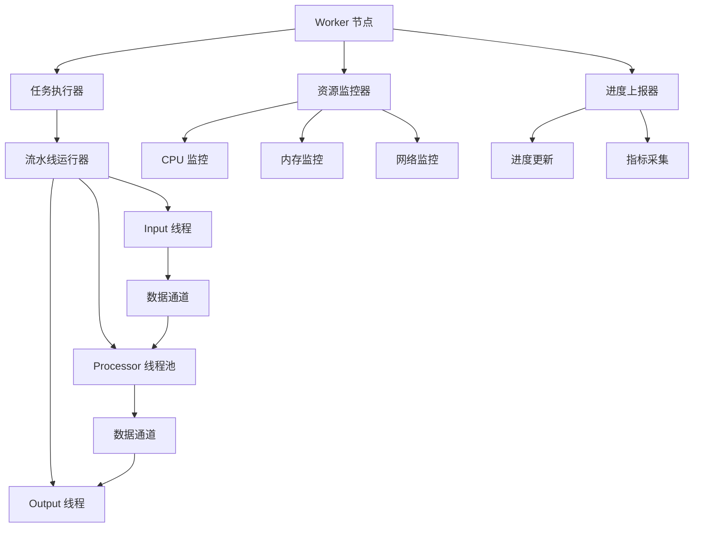

#### Worker 生命周期

1. **注册**: Worker 启动时向任务管理器注册
2. **心跳**: 周期性健康检查上报
3. **任务拉取**: 从任务队列拉取任务
4. **执行**: 执行数据流水线
5. **上报**: 发送进度和指标
6. **注销**: 优雅关闭通知

### 5.6 数据通道

#### 通道设计

数据通道连接 Input、Processor 和 Output，采用有界缓冲：

- **缓冲类型**: 环形缓冲区，提高内存效率
- **容量**: 可配置（默认 10,000 条记录）
- **背压**: 缓冲区满时阻塞读取端
- **流控**: 动态调整批次大小

#### 数据格式

| 字段 | 类型 | 说明 |
|------|------|------|
| schema | Schema | 列定义和类型 |
| records | Array | 记录对象数组 |
| metadata | Map | 批次元数据（来源、时间戳） |
| checkpoint | Checkpoint | 位置信息，用于恢复 |

## 4. Plugin Specifications

### 4.1 Reader Plugins

#### Supported Data Sources

| Category | Data Sources | Priority |
|----------|--------------|----------|
| **Relational DB** | MySQL, PostgreSQL, SQL Server, Oracle, MariaDB, TiDB | P0 |
| **NoSQL** | MongoDB, Redis, Cassandra, HBase, DynamoDB | P0 |
| **Time-Series DB** | InfluxDB, TimescaleDB, Prometheus, OpenTSDB | P1 |
| **OLAP** | ClickHouse, Greenplum, Snowflake, BigQuery | P0 |
| **Message Queue** | Kafka, RabbitMQ, NATS, Pulsar, RocketMQ | P0 |
| **Object Storage** | S3, MinIO, OSS, Azure Blob, GCS | P1 |
| **HTTP/API** | REST API, GraphQL, WebSocket | P1 |
| **File System** | CSV, JSON, Parquet, Avro, ORC | P1 |
| **CDC** | Debezium, Maxwell, Canal | P2 |

#### Reader Configuration Template

Each reader plugin accepts configuration parameters:

| Parameter | Description | Example |
|-----------|-------------|---------|
| connection.host | Database host address | 192.168.1.100 |
| connection.port | Service port | 3306 |
| connection.database | Database/schema name | production_db |
| connection.username | Authentication username | etl_user |
| connection.password | Authentication password | encrypted_password |
| connection.options | Additional connection parameters | charset=utf8mb4 |
| query.table | Table or collection name | user_orders |
| query.columns | Column selection | id,name,created_at |
| query.filter | WHERE clause or filter condition | created_at > '2024-01-01' |
| query.split_key | Column for parallelism split | id |
| fetch.size | Records per fetch | 5000 |
| fetch.timeout | Read timeout duration | 30s |

#### MySQL Reader Specification

**Connection Strategy**:
- Use connection pooling for multiple workers
- Enable read-only mode for source protection
- Support SSL/TLS encryption

**Data Extraction**:
- Table scan with pagination using LIMIT/OFFSET or split key
- Incremental extraction based on timestamp or auto-increment ID
- Support for complex SQL queries with JOIN and aggregation

**Performance Optimization**:
- Parallel reading using range partitioning on split key
- Streaming result set to avoid memory overflow
- Index hint suggestion for optimal query plan

#### Kafka Reader Specification

**Connection Strategy**:
- Consumer group management for distributed reading
- Support SASL/SCRAM authentication
- Auto-discovery of brokers

**Data Consumption**:
- Subscribe to topics or topic patterns
- Manual offset management for exactly-once semantics
- Message deserialization (JSON, Avro, Protobuf)

**Performance Optimization**:
- Partition assignment balancing
- Batch message consumption
- Configurable prefetch buffer

### 4.2 Processor Plugins

#### Processor Types

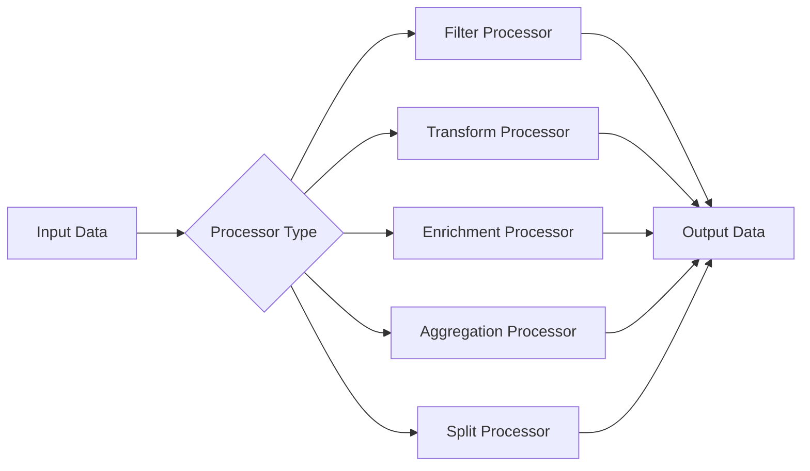

#### Filter Processor

**Purpose**: Remove unwanted records based on conditions

**Configuration**:
| Parameter | Description | Example |
|-----------|-------------|---------|
| condition | Filter expression | age > 18 AND status = 'active' |
| mode | Include or exclude matching records | include |

#### Transform Processor

**Purpose**: Modify field values and structures

**Transformation Operations**:
- **Field Mapping**: Rename columns
- **Type Conversion**: Cast data types
- **Value Mapping**: Replace values based on lookup table
- **Expression Evaluation**: Compute derived fields
- **String Operations**: Concat, substring, trim, regex
- **Date/Time Operations**: Format conversion, timezone adjustment

**Configuration Example**:
| Operation | Source Field | Target Field | Expression |
|-----------|-------------|--------------|------------|
| Rename | user_name | username | - |
| Cast | age | age | String to Integer |
| Compute | - | full_name | CONCAT(first_name, ' ', last_name) |
| Format | created_at | create_date | YYYY-MM-DD format |

#### Enrichment Processor

**Purpose**: Augment data with external information

**Enrichment Sources**:
- External database lookup
- REST API call
- Redis cache lookup
- Static reference table

**Configuration**:
| Parameter | Description |
|-----------|-------------|
| lookup.type | Database, API, Cache |
| lookup.key | Field to use as lookup key |
| lookup.source | Connection configuration |
| lookup.fields | Fields to retrieve |
| cache.enabled | Enable local caching |
| cache.ttl | Cache expiration time |

### 4.3 Writer Plugins

#### Supported Data Targets

Writer plugins mirror reader capabilities with additional targets:
- All reader-supported data sources
- Data warehouses (Snowflake, Redshift, BigQuery)
- Search engines (Elasticsearch, Solr)
- Analytics platforms (Druid)

#### Writer Configuration Template

| Parameter | Description | Example |
|-----------|-------------|---------|
| connection.* | Same as reader connection | - |
| write.mode | Insert, Update, Upsert, Replace | upsert |
| write.table | Target table name | user_dim |
| write.batch_size | Records per batch write | 1000 |
| write.max_retries | Retry count on failure | 3 |
| conflict.strategy | On duplicate key behavior | update |
| conflict.key | Unique constraint columns | id, email |
| pre_sql | SQL to execute before write | TRUNCATE TABLE temp |
| post_sql | SQL to execute after write | CALL refresh_materialized_view() |

#### PostgreSQL Writer Specification

**Write Strategies**:
- **Insert**: Append-only mode
- **Upsert**: INSERT ON CONFLICT DO UPDATE
- **Replace**: DELETE then INSERT
- **Merge**: Staging table + MERGE statement

**Performance Optimization**:
- Batch INSERT with multiple values
- Disable indexes during bulk load
- Use COPY protocol for high throughput
- Parallel writing to partitioned tables

#### Elasticsearch Writer Specification

**Write Operations**:
- Bulk API for batch indexing
- Document ID generation or use source field
- Dynamic mapping or explicit schema

**Performance Optimization**:
- Optimize bulk request size
- Disable refresh during bulk load
- Use ingest pipeline for preprocessing

## 6. Web 管理控制台

### 6.1 功能模块

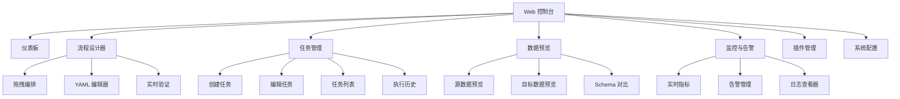

### 6.2 仪表板模块

#### 小组件

| 小组件 | 显示信息 |
|--------|----------|
| **任务统计** | 总任务数、运行中、失败、成功率 |
| **数据量** | 今日/本周/本月传输总记录数 |
| **系统健康** | Worker 状态、资源利用率 |
| **最近失败** | 失败任务及错误摘要 |
| **性能指标** | 吞吐量（记录/秒）、延迟 |
| **活跃任务** | 当前运行任务及进度 |

### 6.3 流程设计器模块

#### 双模式支持

| 模式 | 特点 | 适用人群 |
|------|------|----------|
| **图形化模式** | 拖拽组件，可视化连接 | 业务人员、初学者 |
| **YAML 模式** | 直接编辑 YAML 配置 | 高级用户、开发者 |

#### 切换机制

- **图形→YAML**: 点击“查看配置”按钮，自动生成 YAML
- **YAML→图形**: 点击“可视化”按钮，解析并渲染流程图
- **双向同步**: 任一侧修改后另一侧实时更新

#### 工具栏功能

| 按钮 | 功能 |
|------|------|
| **保存** | 保存当前配置 |
| **验证** | 执行配置验证 |
| **运行** | 直接运行流程 |
| **导入** | 导入已有 YAML 配置 |
| **导出** | 导出为 YAML 文件 |
| **自动布局** | 优化组件布局 |
| **撤销/重做** | 操作历史管理 |
| **全屏** | 全屏模式 |

### 6.4 任务管理模块

#### 任务创建向导（两种方式）

**方式一：可视化创建**

1. **基本信息**: 任务名称、描述、类型（ETL/ELT）
2. **流程设计**: 进入拖拽设计器编排流程
3. **组件配置**: 配置每个组件的参数
4. **调度配置**: 设置执行计划（单次/定时）
5. **预览和验证**: 查看生成的 YAML，执行验证
6. **提交**: 保存并启用任务

**方式二：YAML 直接创建**

1. **基本信息**: 任务名称、描述
2. **YAML 编辑**: 直接编写或粘贴 YAML 配置
3. **实时验证**: 编辑器实时高亮错误
4. **可视化预览**: 点击按钮查看流程图
5. **提交**: 保存并启用任务

#### 任务列表视图

**表格列**：

| 列名 | 说明 | 可排序 | 可筛选 |
|------|------|----------|----------|
| 任务名称 | 显示名称 | 是 | 是 |
| 类型 | ETL/ELT | 否 | 是 |
| 数据源 | 源类型图标+名称 | 否 | 是 |
| 目标 | 目标类型图标+名称 | 否 | 是 |
| 状态 | 当前状态（带颜色） | 是 | 是 |
| 上次运行 | 时间戳 | 是 | 否 |
| 下次运行 | 计划时间 | 是 | 否 |
| 操作 | 启动、停止、编辑、删除 | 否 | 否 |

**批量操作**：
- 启动/停止选中的任务
- 删除多个任务
- 导出任务配置

### 6.5 数据预览模块

#### 源数据预览

**功能**：
- 显示前 N 行（可配置，默认 100）
- Schema 信息（列名、类型、可为空）
- 数据统计（行数、空值比例）
- 每列样本值分布
- SQL 查询编辑器，自定义预览

#### Schema 对比

**功能**：
- 并排显示源和目标 Schema
- 类型兼容性检查
- 缺失列高亮显示
- 数据类型映射建议

**对比表格**：

| 源列名 | 源类型 | 目标列名 | 目标类型 | 状态 |
|----------|----------|------------|------------|------|
| user_id | INT | user_id | BIGINT | 兼容 |
| name | VARCHAR(100) | username | VARCHAR(50) | 警告：长度不匹配 |
| created_at | DATETIME | create_time | TIMESTAMP | 兼容 |
| - | - | updated_at | TIMESTAMP | 源中缺失 |

### 6.6 监控模块

#### 实时指标仪表板

**指标显示**：

| 指标 | 图表类型 |
|------|----------|
| **吞吐量** | 每秒处理记录数（折线图） |
| **资源利用率** | 每个 Worker 的 CPU、内存、网络 I/O（仪表盘） |
| **任务进度** | 活跃任务的进度条 |
| **错误率** | 失败记录百分比（面积图） |
| **延迟** | 每批次平均处理时间（柱状图） |

#### 日志查看器

**功能**：
- 实时日志流
- 日志级别筛选（DEBUG, INFO, WARN, ERROR）
- 任务 ID 筛选
- 关键词搜索
- 时间范围选择
- 导出日志至文件

#### 告警管理

**告警规则**：

| 告警类型 | 触发条件 | 动作 |
|----------|----------|------|
| 任务失败 | 任务状态 = 失败 | 邮件、Webhook |
| 高错误率 | 错误率 > 5% | 邮件、短信 |
| 低吞吐量 | 吞吐量 < 阈值 | 通知 |
| Worker 宕机 | Worker 心跳超时 | 邮件、PagerDuty |
| 磁盘空间 | 可用空间 < 10% | 邮件 |

## 7. API 设计

### 7.1 REST API 端点

#### 任务管理 API

| 方法 | 端点 | 说明 | 请求体 | 响应 |
|------|------|------|----------|------|
| POST | /api/v1/jobs | 创建新任务 | 任务配置（YAML） | 任务 ID 和状态 |
| GET | /api/v1/jobs | 列出所有任务 | 查询参数 | 任务列表及分页 |
| GET | /api/v1/jobs/{id} | 获取任务详情 | - | 任务配置和状态 |
| PUT | /api/v1/jobs/{id} | 更新任务 | 更新后的配置 | 成功状态 |
| DELETE | /api/v1/jobs/{id} | 删除任务 | - | 成功状态 |
| POST | /api/v1/jobs/{id}/start | 启动任务执行 | - | 执行 ID |
| POST | /api/v1/jobs/{id}/stop | 停止运行中的任务 | - | 成功状态 |
| POST | /api/v1/jobs/{id}/pause | 暂停任务 | - | 成功状态 |
| POST | /api/v1/jobs/{id}/resume | 恢复暂停的任务 | - | 成功状态 |
| GET | /api/v1/jobs/{id}/executions | 获取执行历史 | 查询参数 | 执行列表 |
| GET | /api/v1/jobs/{id}/logs | 获取任务日志 | 查询参数 | 日志条目 |

#### 插件管理 API

| 方法 | 端点 | 说明 | 请求体 | 响应 |
|------|------|------|----------|------|
| GET | /api/v1/plugins | 列出所有插件 | 查询筛选 | 插件列表 |
| GET | /api/v1/plugins/{name} | 获取插件详情 | - | 插件元数据 |
| POST | /api/v1/plugins | 安装插件 | 插件二进制或 URL | 安装状态 |
| DELETE | /api/v1/plugins/{name} | 卸载插件 | - | 成功状态 |
| GET | /api/v1/plugins/{name}/config-schema | 获取插件配置 Schema | - | JSON Schema |

#### 数据预览 API

| 方法 | 端点 | 说明 | 请求体 | 响应 |
|------|------|------|----------|------|
| POST | /api/v1/preview/source | 预览源数据 | 源配置 | 数据样本 |
| POST | /api/v1/preview/target | 预览目标数据 | 目标配置 | 数据样本 |
| POST | /api/v1/preview/schema | 对比 Schema | 源和目标配置 | Schema 对比结果 |

#### 监控 API

| 方法 | 端点 | 说明 | 请求体 | 响应 |
|------|------|------|----------|------|
| GET | /api/v1/metrics/jobs/{id} | 获取任务指标 | 时间范围 | 指标数据 |
| GET | /api/v1/metrics/workers | 获取 Worker 指标 | - | Worker 状态列表 |
| GET | /api/v1/metrics/system | 获取系统指标 | - | 系统级指标 |
| GET | /api/v1/alerts | 列出告警 | 查询参数 | 告警列表 |
| POST | /api/v1/alerts | 创建告警规则 | 告警配置 | 告警 ID |
| PUT | /api/v1/alerts/{id} | 更新告警规则 | 更新后的配置 | 成功状态 |
| DELETE | /api/v1/alerts/{id} | 删除告警规则 | - | 成功状态 |

### 7.2 WebSocket API

#### 实时更新

**端点**: `ws://host:port/api/v1/ws`

**消息类型**：

| 类型 | 方向 | 载荷 | 说明 |
|------|------|------|------|
| subscribe | 客户端 → 服务器 | {job_id: "xxx"} | 订阅任务更新 |
| unsubscribe | 客户端 → 服务器 | {job_id: "xxx"} | 取消订阅 |
| job_status | 服务器 → 客户端 | 任务状态对象 | 任务状态变更通知 |
| job_progress | 服务器 → 客户端 | 进度对象 | 进度更新 |
| log_entry | 服务器 → 客户端 | 日志条目对象 | 实时日志 |
| metric_update | 服务器 → 客户端 | 指标对象 | 实时指标 |

## 8. 数据模型

### 8.1 元数据库 Schema

#### 数据库选型说明

系统支持多种元数据库后端，通过配置文件选择：

| 数据库类型 | 适用场景 | 配置示例 |
|----------|----------|----------|
| **SQLite** | 单机、测试、小数据量 | `db.type: sqlite`<br/>`db.path: ./fustgo.db` |
| **PostgreSQL** | 生产、大规模 | `db.type: postgresql`<br/>`db.host: localhost` |
| **MySQL** | 兼容性 | `db.type: mysql`<br/>`db.host: localhost` |

**SQLite 特性**：
- 单文件数据库，零配置
- 嵌入式运行，无需单独服务
- 支持 WAL 模式，提升并发性能
- 支持事务和外键约束
- 适合每天 < 100万记录的场景

#### 任务表 (jobs)

| 字段 | 类型 | 约束 | 说明 |
|------|------|------|------|
| job_id | VARCHAR(64) | PRIMARY KEY | 唯一任务标识 |
| job_name | VARCHAR(255) | NOT NULL | 人类可读名称 |
| job_type | ENUM | NOT NULL | ETL 或 ELT |
| description | TEXT | - | 任务描述 |
| config_yaml | TEXT | NOT NULL | YAML 配置内容 |
| flow_diagram | JSONB | - | 可视化流程图数据 |
| scheduling_config | JSONB | - | 调度参数 |
| status | VARCHAR(32) | NOT NULL | 当前任务状态 |
| created_by | VARCHAR(64) | - | 创建者用户 ID |
| created_at | TIMESTAMP | NOT NULL | 创建时间 |
| updated_at | TIMESTAMP | NOT NULL | 最后更新时间 |
| enabled | BOOLEAN | DEFAULT TRUE | 启用/禁用标记 |

#### 执行记录表 (executions)

**设计原则**：
- 仅存储必要的执行元数据
- 不存储详细的数据处理记录
- 定期清理历史数据（保留 30 天）
- 详细日志存储在 OpenObserve 和本地文件

| 字段 | 类型 | 约束 | 说明 |
|------|------|------|------|
| execution_id | VARCHAR(64) | PRIMARY KEY | 唯一执行标识 |
| job_id | VARCHAR(64) | FOREIGN KEY | 关联任务表 |
| status | VARCHAR(32) | NOT NULL | 执行状态 |
| start_time | TIMESTAMP | NOT NULL | 执行开始时间 |
| end_time | TIMESTAMP | - | 执行结束时间 |
| records_read | BIGINT | DEFAULT 0 | 总读取记录数 |
| records_written | BIGINT | DEFAULT 0 | 总写入记录数 |
| records_failed | BIGINT | DEFAULT 0 | 失败记录数 |
| bytes_transferred | BIGINT | DEFAULT 0 | 总传输字节数 |
| error_message | TEXT | - | 简要错误信息（详细日志在 OpenObserve） |
| worker_id | VARCHAR(64) | - | 执行 Worker ID |
| checkpoint_data | TEXT | - | 检查点数据（简化，用于恢复） |

#### 插件表 (plugins)

| 字段 | 类型 | 约束 | 说明 |
|------|------|------|------|
| plugin_id | VARCHAR(64) | PRIMARY KEY | 唯一插件标识 |
| plugin_name | VARCHAR(255) | UNIQUE, NOT NULL | 插件名称 |
| plugin_type | VARCHAR(32) | NOT NULL | Input, Processor, Output |
| version | VARCHAR(32) | NOT NULL | 插件版本 |
| data_source_type | VARCHAR(64) | - | 支持的数据源 |
| binary_path | VARCHAR(512) | NOT NULL | 插件二进制位置 |
| config_schema | JSONB | NOT NULL | 配置 JSON Schema |
| metadata | JSONB | - | 额外元数据 |
| enabled | BOOLEAN | DEFAULT TRUE | 启用/禁用标记 |
| installed_at | TIMESTAMP | NOT NULL | 安装时间 |

#### Worker 表 (workers)

| 字段 | 类型 | 约束 | 说明 |
|------|------|------|------|
| worker_id | VARCHAR(64) | PRIMARY KEY | 唯一 Worker 标识 |
| hostname | VARCHAR(255) | NOT NULL | Worker 主机名 |
| ip_address | VARCHAR(45) | NOT NULL | IP 地址 |
| port | INTEGER | NOT NULL | 服务端口 |
| status | VARCHAR(32) | NOT NULL | Online, Offline, Busy |
| cpu_cores | INTEGER | - | CPU 核心数 |
| memory_mb | INTEGER | - | 总内存 MB |
| last_heartbeat | TIMESTAMP | NOT NULL | 最后心跳时间 |
| registered_at | TIMESTAMP | NOT NULL | 注册时间 |

#### 告警规则表 (alert_rules)

| 字段 | 类型 | 约束 | 说明 |
|------|------|------|------|
| alert_id | VARCHAR(64) | PRIMARY KEY | 唯一告警标识 |
| alert_name | VARCHAR(255) | NOT NULL | 告警名称 |
| alert_type | VARCHAR(64) | NOT NULL | 告警类型 |
| condition | JSONB | NOT NULL | 告警条件 |
| action | JSONB | NOT NULL | 告警动作配置 |
| enabled | BOOLEAN | DEFAULT TRUE | 启用/禁用标记 |
| created_at | TIMESTAMP | NOT NULL | 创建时间 |

### 8.2 内存数据结构

#### DataBatch 结构

表示通过流水线传输的一批记录：

| 字段 | 类型 | 说明 |
|------|------|------|
| schema | Schema | 列定义 |
| records | Array of Record | 实际数据行 |
| metadata | Map | 批次元数据 |
| checkpoint | Checkpoint | 位置信息 |

#### Schema 结构

| 字段 | 类型 | 说明 |
|------|------|------|
| columns | Array of Column | 列定义 |
| primary_keys | Array of String | 主键列名 |

#### Column 结构

| 字段 | 类型 | 说明 |
|------|------|------|
| name | String | 列名 |
| data_type | DataType | 列数据类型 |
| nullable | Boolean | 允许 NULL 值 |
| default_value | Any | 默认值 |

#### Record Structure

| Field | Type | Description |
|-------|------|-------------|
| values | Array of Any | Field values in schema order |
| metadata | Map | Record-level metadata |

## 9. 安全设计

### 9.1 认证与授权

#### 用户认证

**支持的方法**：
- 用户名/密码认证
- LDAP/Active Directory 集成
- OAuth2（Google, GitHub）
- JWT Token 认证

#### 基于角色的访问控制 (RBAC)

| 角色 | 权限 |
|------|------|
| **管理员** | 完整系统访问、用户管理、插件安装 |
| **开发者** | 创建/编辑任务、查看所有任务、执行任务 |
| **运维人员** | 启动/停止任务、查看任务、查看监控 |
| **观察者** | 只读访问任务和监控 |

#### 资源级别权限

- 任务所有权和共享
- 插件访问控制
- 数据源连接权限

### 9.2 数据安全

#### 敏感数据保护

- **密码加密**: 所有密码使用 AES-256 加密
- **连接字符串掉码**: UI 和日志中隐藏凭证
- **密钥管理**: 集成 HashiCorp Vault 或 AWS Secrets Manager
- **数据脱敏**: 数据预览中的可选字段级脱敏

#### 网络安全

- **TLS/SSL**: Web UI 和 API 使用 HTTPS
- **证书管理**: 使用 Let's Encrypt 自动续期
- **IP 白名单**: 按 IP 限制 Worker 注册
- **VPC 支持**: 在私有网络内部署

### 9.3 审计日志

#### 审计事件

| 事件类型 | 记录详情 |
|----------|----------|
| 用户登录 | 用户名、IP、时间戳、成功/失败 |
| 任务创建 | 任务 ID、创建者、配置 |
| 任务修改 | 任务 ID、修改者、变更内容 |
| 任务执行 | 执行 ID、触发者、状态 |
| 插件安装 | 插件名称、安装者、来源 |
| 配置更改 | 组件、旧值、新值 |

#### 日志保留

- 审计日志保留可配置时间（默认 90 天）
- 导出到外部 SIEM 系统（Splunk, ELK）

## 10. 性能优化

### 10.1 吞吐量优化

#### 并行策略

**Input 并行**：
- 按范围分割数据源（ID 范围、日期范围）
- 每个 Worker 读取不相交的数据子集
- 根据数据分布动态调整分割

**Output 并行**：
- 多个 Writer 写入不同分区
- 批量写入减少网络往返
- 异步写入带确认

#### 批次大小调优

- 默认批次大小：1,000 条记录
- 根据记录大小自适应调整
- 小记录使用较大批次，大记录使用较小批次

### 10.2 内存管理

#### 内存分配

- 有界数据通道防止 OOM
- 流式处理，不加载全量数据集
- 记录对象的内存池

#### 垃圾回收优化

- 重用记录缓冲区
- 最小化热路径中的对象分配
- 使用 sync.Pool 管理临时对象

### 10.3 网络优化

#### 连接池

- 为数据库源/目标维护连接池
- 每个 Worker 可配置池大小
- 连接健康检查和回收

#### 数据压缩

- 组件间数据传输的可选压缩
- 支持 Snappy, LZ4, Gzip 压缩
- 大记录自动压缩

## 11. 可靠性与容错

### 11.1 检查点与恢复

#### 检查点机制

- 周期性检查点保存流水线位置
- 检查点包括 Reader 位置和已处理记录数
- 检查点存储在 Redis 或元数据库

#### 恢复流程

当任务失败或重启时：
1. 加载最后一次成功的检查点
2. Reader 从检查点位置恢复
3. 跳过目标中已处理的记录（幂等写入）
4. 继续执行

### 11.2 错误处理

#### 错误分类

| 类别 | 处理策略 |
|------|----------|
| **瞬时错误** | 指数退避重试 |
| **连接错误** | 重连并重试 |
| **数据错误** | 跳过记录、记录错误、继续 |
| **致命错误** | 停止任务、通知运维人员 |

#### 重试策略

| 参数 | 默认值 | 说明 |
|------|---------|------|
| max_retries | 3 | 最大重试次数 |
| initial_delay | 1s | 重试前的初始延迟 |
| max_delay | 30s | 重试间最大延迟 |
| backoff_multiplier | 2.0 | 指数退避因子 |

#### 死信队列

- 失败记录发送到死信队列
- 存储失败记录及错误详情
- 支持手动重试或导出分析

### 11.3 高可用性

#### 组件冗余

- **任务管理器**: 主备部署，领导选举
- **Worker 池**: 水平扩展，自动故障转移
- **元数据库**: 主从复制
- **任务队列**: 集群化消息队列

#### 健康检查

- Worker 每 10 秒心跳
- 任务管理器监控 Worker 健康
- 心跳超时自动注销 Worker
- Worker 故障时自动重新调度任务

## 12. 监控与可观测性

### 12.1 OpenObserve 集成

#### 架构设计

**为什么选择 OpenObserve**：
- **统一平台**: 同时支持日志、指标、追踪
- **轻量级**: 相比 Prometheus + Loki + Tempo 更轻量
- **易部署**: Docker Compose 一键部署
- **低成本**: 存储成本降低 140 倍（相比 Elasticsearch）
- **兼容性**: 支持 Prometheus、Loki 协议

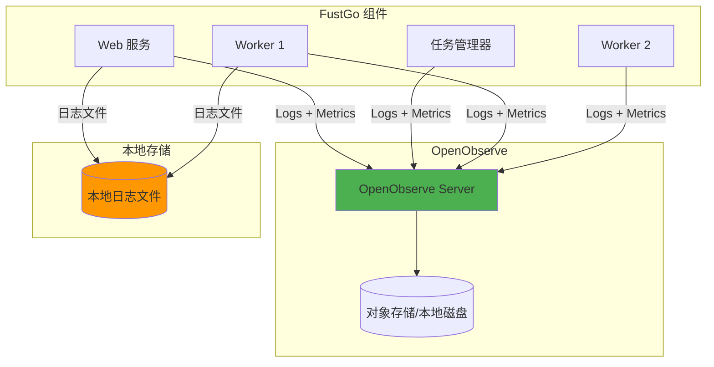

#### 日志收集

**双重存储策略**：

1. **本地文件系统**（必须）：
   - 路径：/var/log/fustgo/
   - 格式：JSON Lines
   - 滚动：按天分割，保留 7 天
   - 用途：故障排查、离线分析

2. **OpenObserve**（推荐）：
   - 实时推送日志到 OpenObserve
   - 支持全文搜索和分析
   - 长期存储（可配置保留期）

**日志结构**：

每条日志包含字段：
- timestamp: 时间戳
- level: 日志级别（DEBUG/INFO/WARN/ERROR）
- service: 服务名称（web/job-manager/worker）
- job_id: 任务 ID（如果有）
- execution_id: 执行 ID（如果有）
- worker_id: Worker ID（如果有）
- message: 日志消息
- error: 错误详情（如果有）
- context: 上下文信息（map）

**日志级别使用**：

| 级别 | 用途 | 示例 |
|------|------|------|
| DEBUG | 详细调试信息 | 数据批次详情、配置参数 |
| INFO | 一般信息 | 任务开始/完成、Worker 注册 |
| WARN | 警告信息 | 重试操作、性能降级 |
| ERROR | 错误信息 | 任务失败、连接错误 |
| FATAL | 致命错误 | 服务崩溃 |

#### 指标收集

**推送方式**：
- 使用 OpenObserve 的 Prometheus Remote Write API
- 每 15 秒推送一次指标
- 使用 Prometheus Go 客户端库

**系统指标**：

| 指标名 | 类型 | 标签 | 说明 |
|--------|------|------|------|
| fustgo_jobs_total | Counter | status | 任务总数 |
| fustgo_jobs_running | Gauge | - | 运行中任务数 |
| fustgo_jobs_duration_seconds | Histogram | job_id, status | 任务执行时长 |
| fustgo_records_processed_total | Counter | job_id, plugin | 处理记录数 |
| fustgo_records_failed_total | Counter | job_id, reason | 失败记录数 |
| fustgo_bytes_transferred_total | Counter | job_id | 传输字节数 |
| fustgo_workers_online | Gauge | - | 在线 Worker 数 |
| fustgo_worker_cpu_percent | Gauge | worker_id | Worker CPU 使用率 |
| fustgo_worker_memory_bytes | Gauge | worker_id | Worker 内存使用 |
| fustgo_plugin_duration_seconds | Histogram | plugin_name, type | 插件执行时长 |

**业务指标**：

| 指标名 | 类型 | 说明 |
|--------|------|------|
| fustgo_throughput_records_per_second | Gauge | 实时吞吐量 |
| fustgo_error_rate | Gauge | 错误率 |
| fustgo_queue_depth | Gauge | 任务队列深度 |
| fustgo_checkpoint_age_seconds | Gauge | 检查点年龄 |

#### 追踪集成

**分布式追踪**：
- 使用 OpenTelemetry SDK
- 每个任务执行生成 Trace
- Trace 包含 Input → Processors → Output 的完整链路
- 推送到 OpenObserve 的 Traces API

**Trace 结构**：

```
Trace: execution_{execution_id}
├─ Span: job_start
├─ Span: input_read (plugin: mysql)
│  ├─ Span: connect
│  └─ Span: read_batch
├─ Span: processor_filter
├─ Span: processor_transform
├─ Span: output_write (plugin: postgresql)
│  ├─ Span: connect
│  └─ Span: write_batch
└─ Span: job_complete
```

### 12.2 OpenObserve 配置

#### Docker Compose 配置

OpenObserve 服务配置：

services:
  openobserve:
    image: public.ecr.aws/zinclabs/openobserve:latest
    container_name: openobserve
    ports:
      - "5080:5080"  # Web UI
    environment:
      - ZO_ROOT_USER_EMAIL=admin@example.com
      - ZO_ROOT_USER_PASSWORD=admin_password
      - ZO_DATA_DIR=/data
    volumes:
      - openobserve_data:/data
    networks:
      - fustgo_network

#### FustGo 配置

配置文件示例（config.yaml）：

observability:
  logs:
    local:
      enabled: true
      path: /var/log/fustgo
      max_size: 100MB  # 单文件最大大小
      max_age: 7  # 保留天数
      max_backups: 10  # 最多保留文件数
      compress: true  # 压缩旧日志
    
    openobserve:
      enabled: true
      endpoint: http://openobserve:5080
      organization: default
      stream: fustgo_logs
      auth:
        username: admin@example.com
        password: admin_password
      batch_size: 100  # 批量发送
      flush_interval: 5s
  
  metrics:
    openobserve:
      enabled: true
      endpoint: http://openobserve:5080/api/default/prometheus/api/v1/write
      push_interval: 15s
      auth:
        username: admin@example.com
        password: admin_password
  
  traces:
    openobserve:
      enabled: true
      endpoint: http://openobserve:5080
      organization: default
      auth:
        username: admin@example.com
        password: admin_password

### 12.3 监控仪表板

#### OpenObserve 内置仪表板

**系统概览仪表板**：
- 任务执行趋势（成功/失败）
- 实时吞吐量
- Worker 状态
- 错误率趋势
- 资源使用情况

**任务详情仪表板**：
- 单个任务的执行历史
- 数据流量统计
- 插件性能分析
- 错误日志列表

**性能分析仪表板**：
- 插件耗时分布
- 批次处理延迟
- 队列深度监控
- 检查点间隔

#### Web UI 集成

**嵌入 OpenObserve 视图**：
- 在 FustGo Web UI 中嵌入 OpenObserve iframe
- 通过 SSO 或共享认证
- 提供快速跳转到 OpenObserve 的链接

### 12.4 告警配置

#### OpenObserve 告警规则

**关键告警**：

1. **任务失败告警**：
   - 条件：任务状态为 Failed
   - 通知：Email, Webhook
   
2. **高错误率告警**：
   - 条件：错误率 > 5%
   - 通知：Email, Slack
   
3. **Worker 下线告警**：
   - 条件：Worker 心跳超时
   - 通知：Email, PagerDuty
   
4. **队列堆积告警**：
   - 条件：队列深度 > 100
   - 通知：Slack

5. **资源告警**：
   - 条件：CPU > 80% 或 Memory > 90%
   - 通知：Email

- Assign trace ID to each job execution
- Propagate trace context through reader → processor → writer
- Correlate logs and metrics with trace ID

#### Tracing Integration

- OpenTelemetry instrumentation
- Export traces to Jaeger or Zipkin
- Visualize end-to-end data flow latency

### 11.3 Logging Strategy

#### Log Levels

| Level | Usage |
|-------|-------|
| DEBUG | Detailed debugging information |
| INFO | General informational messages |
| WARN | Warning messages for potential issues |
| ERROR | Error messages for failures |
| FATAL | Fatal errors causing shutdown |

#### Structured Logging

- Use structured logging format (JSON)
- Include context fields (job_id, execution_id, worker_id)
- Support log aggregation in ELK or Loki

## 12. Scalability Design

### 12.1 Horizontal Scaling

#### Worker Scaling

- Add worker nodes dynamically based on workload
- Auto-scaling based on task queue depth
- Kubernetes deployment with HPA (Horizontal Pod Autoscaler)

#### Database Scaling

- Read replicas for metadata database
- Sharding for large-scale job history
- Time-series database for metrics storage

### 12.2 Performance Benchmarks

#### Target Performance Metrics

| Scenario | Target Throughput |
|----------|-------------------|
| MySQL → PostgreSQL (Simple copy) | 100,000 records/sec |
| Kafka → Elasticsearch (With transformation) | 50,000 records/sec |
| MongoDB → S3 (Export JSON) | 30,000 records/sec |
| HTTP API → Database (With enrichment) | 10,000 records/sec |

### 12.3 Resource Requirements

#### Minimum System Requirements

| Component | CPU | Memory | Disk | Network |
|-----------|-----|--------|------|---------|
| Job Manager | 2 cores | 4 GB | 50 GB | 1 Gbps |
| Worker Node | 4 cores | 8 GB | 100 GB | 1 Gbps |
| Metadata DB | 4 cores | 16 GB | 500 GB | 1 Gbps |
| Redis | 2 cores | 4 GB | 20 GB | 1 Gbps |

#### Recommended Configuration

For processing 1 million records/day:
- 1 Job Manager instance
- 3-5 Worker nodes
- 1 PostgreSQL instance (with replication)
- 1 Redis instance (with persistence)

## 13. Configuration Management

### 13.1 Configuration Center

#### Configuration Hierarchy

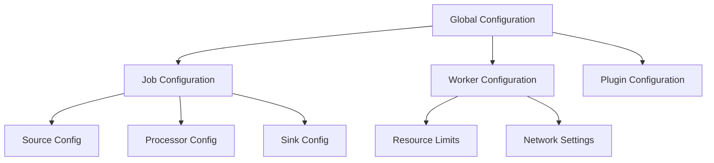

#### Global Configuration Parameters

| Category | Parameter | Default | Description |
|----------|-----------|---------|-------------|
| **System** | server.port | 8080 | API server port |
| | server.mode | production | Run mode (dev/production) |
| | log.level | info | Logging level |
| | log.path | /var/log/fustgo | Log file directory |
| **Database** | db.host | localhost | PostgreSQL host |
| | db.port | 5432 | PostgreSQL port |
| | db.name | fustgo | Database name |
| | db.pool_size | 20 | Connection pool size |
| **Redis** | redis.host | localhost | Redis host |
| | redis.port | 6379 | Redis port |
| | redis.db | 0 | Redis database number |
| **Worker** | worker.max_concurrent_jobs | 5 | Max jobs per worker |
| | worker.heartbeat_interval | 10s | Heartbeat frequency |
| | worker.task_poll_interval | 5s | Task polling frequency |
| **Plugin** | plugin.directory | /opt/fustgo/plugins | Plugin installation directory |
| | plugin.auto_discover | true | Auto-discover plugins on startup |

### 13.2 配置热重载

#### 支持的配置变更

- 日志级别调整
- Worker 资源限制
- 插件启用/禁用
- 告警规则修改

#### 重载机制

- 监控配置文件变化
- 文件修改事件时重载
- 无需重启即可应用变更
- 通过事件总线通知组件

## 14. 测试策略

### 14.1 单元测试

#### 测试覆盖率目标

| 组件 | 目标覆盖率 |
|------|-----------|
| 核心逻辑 | 80%+ |
| 插件接口 | 90%+ |
| API 处理器 | 75%+ |
| 工具函数 | 85%+ |

#### 测试框架

- **测试运行器**: Go 原生 testing 包
- **Mock**: testify/mock 用于接口 Mock
- **断言**: testify/assert 用于可读断言

### 14.2 集成测试

#### 测试场景

**端到端数据流水线**：
- 设置带测试数据的源数据库
- 通过 API 配置 ETL 任务
- 执行任务并验证目标数据
- 验证数据准确性和完整性

**插件集成**：
- 使用真实数据源测试每个 Input 插件
- 使用样本数据测试 Processor 链
- 使用目标系统测试 Output 插件

**故障恢复**：
- 模拟执行期间 Worker 崩溃
- 验证检查点和恢复机制
- 确保没有数据丢失或重复

### 14.3 性能测试

#### 负载测试

- 模拟高并发任务提交
- 测量负载下的系统吞吐量
- 识别瓶颈和资源限制

#### 压力测试

- 将系统推至正常容量之外
- 测试故障模式和降级
- 验证极端负载下的系统稳定性

#### 基准测试

- 测量不同数据源的吞吐量
- 比较不同配置的性能
- 建立基线性能指标

## 15. 部署模式详细说明

### 15.1 单机模式

#### 特点

- **零依赖**: 无需 Redis、PostgreSQL、NATS 等外部组件
- **单文件部署**: 一个可执行文件 + 一个 SQLite 文件
- **快速启动**: 几秒内完成启动
- **轻量级**: 占用资源少，适合小数据量

#### 适用场景

- 开发和测试环境
- 小型数据迁移项目
- 边缘计算场景
- 学习和演示
- 每天 < 10万记录的同步任务

#### 启动步骤

1. 下载可执行文件
2. 创建配置文件（可选，使用默认配置）
3. 运行：`./fustgo`
4. 访问 Web 界面：`http://localhost:8080`

#### 性能指标

- 吞吐量：5,000 - 20,000 记录/秒
- 并发任务：1-5 个
- 内存占用：200MB - 1GB

### 15.2 轻量模式

#### 特点

- **可分布**: Worker 可部署在不同主机
- **灵活扩展**: 根据负载增减 Worker
- **简单维护**: 仍然无需复杂中间件
- **SQLite 或 PostgreSQL**: 可根据需求选择

#### 适用场景

- 中小型企业生产环境
- 资源有限的场景
- 需要简单扩展的场景
- 每天 10-100万记录的同步任务

#### 部署拓扑

**同机部署**：
- 主服务 + 2-3 个 Worker 在同一主机
- 使用本地 SQLite
- 通过数据库轮询分发任务

**分机部署**：
- 主服务器：1 台
- Worker 节点：2-5 台
- 共享 SQLite（NFS）或使用 PostgreSQL

#### 性能指标

- 吞吐量：20,000 - 80,000 记录/秒
- 并发任务：5-20 个
- 内存占用：每节点 500MB - 2GB

### 15.3 分布式模式

#### 特点

- **高可用**: 主备架构，自动故障转移
- **水平扩展**: 轻松扩展到几十个 Worker
- **企业级**: 完整的监控、告警、审计
- **高性能**: 支持大规模数据同步

#### 适用场景

- 大型企业生产环境
- 关键业务系统
- 高并发、大数据量场景
- 每天 > 100万记录的同步任务

#### 部署拓扑

- 任务管理器：2 台（主备）
- Worker 集群：5-50 台
- PostgreSQL：1 主 2 从
- Redis 集群：3-6 节点
- NATS 集群：3 节点

#### 性能指标

- 吞吐量：100,000 - 500,000+ 记录/秒
- 并发任务：50-200 个
- 内存占用：每 Worker 2-8GB

### 15.4 模式切换指南

#### 从单机升级到轻量模式

1. **数据迁移**：
   - 备份 SQLite 数据库
   - （可选）迁移到 PostgreSQL

2. **配置调整**：
   - 修改 deployment.mode 为 lightweight
   - 设置 queue.type 为 database
   - 配置共享数据库路径

3. **启动 Worker**：
   - 在新主机上启动 Worker 节点
   - Worker 自动连接到主服务器

#### 从轻量升级到分布式模式

1. **部署中间件**：
   - 搭建 PostgreSQL 集群
   - 部署 Redis 集群
   - 部署 NATS 集群

2. **数据迁移**：
   - 使用工具将 SQLite 数据导入 PostgreSQL
   - 验证数据完整性

3. **配置调整**：
   - 修改 deployment.mode 为 distributed
   - 配置所有中间件连接
   - 启用高可用特性

4. **灰度切换**：
   - 先启动新集群
   - 逐步迁移任务
   - 验证后关闭旧系统

### 15.5 Redis 可选性设计

#### 无 Redis 运行方案

**单机模式**：
- 使用 sync.Map 作为内存缓存
- 使用 sync.Mutex 实现本地锁
- 无分布式锁需求

**轻量模式**：
- 使用数据库表作为缓存
- 使用数据库事务实现分布式锁
- 性能适当降低，但满足中小规模需求

**分布式模式**：
- 建议使用 Redis
- 如果不用 Redis，可使用：
  - etcd 作为分布式锁
  - Memcached 作为缓存
  - 数据库表 + 定期清理

#### 性能对比

| 场景 | 有 Redis | 无 Redis | 差异 |
|------|---------|---------|------|
| 单机模式 | 20K 记录/秒 | 18K 记录/秒 | -10% |
| 轻量模式 | 80K 记录/秒 | 60K 记录/秒 | -25% |
| 分布式模式 | 500K 记录/秒 | 300K 记录/秒 | -40% |

**结论**：
- 单机和轻量模式下，无 Redis 影响较小
- 分布式模式建议使用 Redis 以获得最佳性能

## 16. Docker Compose 部署

### 16.1 部署架构

#### 单机模式 Docker Compose

**服务组件**：
- fustgo-standalone：单一服务容器
- openobserve：监控和日志

**docker-compose.standalone.yml**：

配置包含：

version: '3.8'

services:
  fustgo:
    image: fustgo:latest
    container_name: fustgo-standalone
    ports:
      - "8080:8080"  # Web UI
    environment:
      - FUSTGO_MODE=standalone
      - FUSTGO_DB_TYPE=sqlite
      - FUSTGO_DB_PATH=/data/fustgo.db
      - FUSTGO_LOG_PATH=/var/log/fustgo
      - FUSTGO_OPENOBSERVE_ENABLED=true
      - FUSTGO_OPENOBSERVE_ENDPOINT=http://openobserve:5080
    volumes:
      - fustgo_data:/data
      - fustgo_logs:/var/log/fustgo
      - ./plugins:/opt/fustgo/plugins:ro  # 自定义插件（可选）
    networks:
      - fustgo_network
    restart: unless-stopped
    healthcheck:
      test: ["CMD", "curl", "-f", "http://localhost:8080/health"]
      interval: 30s
      timeout: 10s
      retries: 3
  
  openobserve:
    image: public.ecr.aws/zinclabs/openobserve:latest
    container_name: openobserve
    ports:
      - "5080:5080"
    environment:
      - ZO_ROOT_USER_EMAIL=admin@fustgo.local
      - ZO_ROOT_USER_PASSWORD=changeme
      - ZO_DATA_DIR=/data
    volumes:
      - openobserve_data:/data
    networks:
      - fustgo_network
    restart: unless-stopped

volumes:
  fustgo_data:
  fustgo_logs:
  openobserve_data:

networks:
  fustgo_network:
    driver: bridge

#### 轻量模式 Docker Compose

**服务组件**：
- fustgo-master：主服务器
- fustgo-worker-1/2/3：Worker 节点
- postgres（可选）：替代 SQLite
- openobserve：监控和日志

**docker-compose.lightweight.yml**：

配置包含：

version: '3.8'

services:
  fustgo-master:
    image: fustgo:latest
    container_name: fustgo-master
    ports:
      - "8080:8080"
    environment:
      - FUSTGO_MODE=lightweight
      - FUSTGO_ROLE=master
      - FUSTGO_DB_TYPE=postgresql
      - FUSTGO_DB_HOST=postgres
      - FUSTGO_DB_PORT=5432
      - FUSTGO_DB_NAME=fustgo
      - FUSTGO_DB_USER=fustgo
      - FUSTGO_DB_PASSWORD=fustgo_pass
      - FUSTGO_QUEUE_TYPE=database
      - FUSTGO_OPENOBSERVE_ENDPOINT=http://openobserve:5080
    volumes:
      - fustgo_master_logs:/var/log/fustgo
    networks:
      - fustgo_network
    depends_on:
      - postgres
      - openobserve
    restart: unless-stopped
  
  fustgo-worker-1:
    image: fustgo:latest
    container_name: fustgo-worker-1
    environment:
      - FUSTGO_MODE=lightweight
      - FUSTGO_ROLE=worker
      - FUSTGO_MASTER_URL=http://fustgo-master:8080
      - FUSTGO_DB_TYPE=postgresql
      - FUSTGO_DB_HOST=postgres
      - FUSTGO_WORKER_COUNT=4
    volumes:
      - fustgo_worker1_logs:/var/log/fustgo
    networks:
      - fustgo_network
    depends_on:
      - fustgo-master
    restart: unless-stopped
  
  fustgo-worker-2:
    image: fustgo:latest
    container_name: fustgo-worker-2
    environment:
      - FUSTGO_MODE=lightweight
      - FUSTGO_ROLE=worker
      - FUSTGO_MASTER_URL=http://fustgo-master:8080
      - FUSTGO_DB_TYPE=postgresql
      - FUSTGO_DB_HOST=postgres
      - FUSTGO_WORKER_COUNT=4
    volumes:
      - fustgo_worker2_logs:/var/log/fustgo
    networks:
      - fustgo_network
    depends_on:
      - fustgo-master
    restart: unless-stopped
  
  postgres:
    image: postgres:15-alpine
    container_name: fustgo-postgres
    environment:
      - POSTGRES_DB=fustgo
      - POSTGRES_USER=fustgo
      - POSTGRES_PASSWORD=fustgo_pass
    volumes:
      - postgres_data:/var/lib/postgresql/data
    networks:
      - fustgo_network
    restart: unless-stopped
  
  openobserve:
    image: public.ecr.aws/zinclabs/openobserve:latest
    container_name: openobserve
    ports:
      - "5080:5080"
    environment:
      - ZO_ROOT_USER_EMAIL=admin@fustgo.local
      - ZO_ROOT_USER_PASSWORD=changeme
      - ZO_DATA_DIR=/data
    volumes:
      - openobserve_data:/data
    networks:
      - fustgo_network
    restart: unless-stopped

volumes:
  fustgo_master_logs:
  fustgo_worker1_logs:
  fustgo_worker2_logs:
  postgres_data:
  openobserve_data:

networks:
  fustgo_network:
    driver: bridge

#### 分布式模式 Docker Compose

**服务组件**：
- fustgo-master-1/2：主备主服务器
- fustgo-worker-1/2/N：Worker 集群
- postgres-master：PostgreSQL 主库
- postgres-replica：PostgreSQL 从库
- redis-cluster：Redis 集群
- nats：NATS 消息队列
- openobserve：监控和日志

**docker-compose.distributed.yml**：

配置包含：

version: '3.8'

services:
  # 主服务器 (主)
  fustgo-master-1:
    image: fustgo:latest
    container_name: fustgo-master-1
    ports:
      - "8080:8080"
    environment:
      - FUSTGO_MODE=distributed
      - FUSTGO_ROLE=master
      - FUSTGO_DB_TYPE=postgresql
      - FUSTGO_DB_HOST=postgres-master
      - FUSTGO_CACHE_TYPE=redis
      - FUSTGO_REDIS_CLUSTER=true
      - FUSTGO_REDIS_NODES=redis-1:6379,redis-2:6379,redis-3:6379
      - FUSTGO_QUEUE_TYPE=nats
      - FUSTGO_NATS_URL=nats://nats:4222
      - FUSTGO_HA_ENABLED=true
    volumes:
      - fustgo_master1_logs:/var/log/fustgo
    networks:
      - fustgo_network
    depends_on:
      - postgres-master
      - nats
      - openobserve
    restart: unless-stopped
  
  # 主服务器 (备)
  fustgo-master-2:
    image: fustgo:latest
    container_name: fustgo-master-2
    ports:
      - "8081:8080"
    environment:
      - FUSTGO_MODE=distributed
      - FUSTGO_ROLE=master
      - FUSTGO_DB_TYPE=postgresql
      - FUSTGO_DB_HOST=postgres-master
      - FUSTGO_CACHE_TYPE=redis
      - FUSTGO_QUEUE_TYPE=nats
      - FUSTGO_HA_ENABLED=true
    volumes:
      - fustgo_master2_logs:/var/log/fustgo
    networks:
      - fustgo_network
    depends_on:
      - postgres-master
      - nats
    restart: unless-stopped
  
  # Worker 节点
  fustgo-worker-1:
    image: fustgo:latest
    container_name: fustgo-worker-1
    environment:
      - FUSTGO_MODE=distributed
      - FUSTGO_ROLE=worker
      - FUSTGO_MASTER_URLS=http://fustgo-master-1:8080,http://fustgo-master-2:8080
      - FUSTGO_DB_HOST=postgres-replica  # 读从库
      - FUSTGO_CACHE_TYPE=redis
      - FUSTGO_QUEUE_TYPE=nats
      - FUSTGO_WORKER_COUNT=8
    volumes:
      - fustgo_worker1_logs:/var/log/fustgo
    networks:
      - fustgo_network
    depends_on:
      - fustgo-master-1
    restart: unless-stopped
    deploy:
      replicas: 3  # 可扩展到 N 个 Worker
  
  # PostgreSQL 主库
  postgres-master:
    image: postgres:15-alpine
    container_name: postgres-master
    environment:
      - POSTGRES_DB=fustgo
      - POSTGRES_USER=fustgo
      - POSTGRES_PASSWORD=fustgo_pass
      - POSTGRES_REPLICATION_MODE=master
    volumes:
      - postgres_master_data:/var/lib/postgresql/data
    networks:
      - fustgo_network
    restart: unless-stopped
  
  # PostgreSQL 从库
  postgres-replica:
    image: postgres:15-alpine
    container_name: postgres-replica
    environment:
      - POSTGRES_REPLICATION_MODE=slave
      - POSTGRES_MASTER_HOST=postgres-master
    volumes:
      - postgres_replica_data:/var/lib/postgresql/data
    networks:
      - fustgo_network
    depends_on:
      - postgres-master
    restart: unless-stopped
  
  # Redis 集群
  redis-1:
    image: redis:7-alpine
    container_name: redis-1
    command: redis-server --cluster-enabled yes --cluster-config-file nodes.conf
    networks:
      - fustgo_network
    restart: unless-stopped
  
  redis-2:
    image: redis:7-alpine
    container_name: redis-2
    command: redis-server --cluster-enabled yes --cluster-config-file nodes.conf
    networks:
      - fustgo_network
    restart: unless-stopped
  
  redis-3:
    image: redis:7-alpine
    container_name: redis-3
    command: redis-server --cluster-enabled yes --cluster-config-file nodes.conf
    networks:
      - fustgo_network
    restart: unless-stopped
  
  # NATS 消息队列
  nats:
    image: nats:latest
    container_name: nats
    ports:
      - "4222:4222"
      - "8222:8222"  # 监控端口
    command: ["-js", "-m", "8222"]
    networks:
      - fustgo_network
    restart: unless-stopped
  
  # OpenObserve
  openobserve:
    image: public.ecr.aws/zinclabs/openobserve:latest
    container_name: openobserve
    ports:
      - "5080:5080"
    environment:
      - ZO_ROOT_USER_EMAIL=admin@fustgo.local
      - ZO_ROOT_USER_PASSWORD=changeme
      - ZO_DATA_DIR=/data
    volumes:
      - openobserve_data:/data
    networks:
      - fustgo_network
    restart: unless-stopped

volumes:
  fustgo_master1_logs:
  fustgo_master2_logs:
  fustgo_worker1_logs:
  postgres_master_data:
  postgres_replica_data:
  openobserve_data:

networks:
  fustgo_network:
    driver: bridge

### 16.2 构建 Docker 镜像

#### Dockerfile

**多阶段构建**：

Dockerfile 内容示例：

# 阶段 1: 构建
FROM golang:1.23-alpine AS builder

WORKDIR /build

# 安装依赖
COPY go.mod go.sum ./
RUN go mod download

# 复制源代码
COPY . .

# 编译 (静态链接,包含所有插件)
RUN CGO_ENABLED=1 GOOS=linux go build -a \
    -ldflags '-linkmode external -extldflags "-static" -s -w' \
    -tags 'sqlite_omit_load_extension' \
    -o fustgo \
    ./cmd/fustgo

# 阶段 2: 运行时
FROM alpine:latest

RUN apk --no-cache add ca-certificates tzdata curl

WORKDIR /app

# 从构建阶段复制二进制
COPY --from=builder /build/fustgo /app/fustgo

# 复制默认配置
COPY configs/default.yaml /app/config.yaml

# 创建目录
RUN mkdir -p /data /var/log/fustgo /opt/fustgo/plugins

# 设置权限
RUN addgroup -g 1000 fustgo && \
    adduser -D -s /bin/sh -u 1000 -G fustgo fustgo && \
    chown -R fustgo:fustgo /app /data /var/log/fustgo

USER fustgo

EXPOSE 8080

HEALTHCHECK --interval=30s --timeout=10s --start-period=5s --retries=3 \
    CMD curl -f http://localhost:8080/health || exit 1

ENTRYPOINT ["/app/fustgo"]
CMD ["--config", "/app/config.yaml"]

#### 构建命令

**本地构建**：

bash
docker build -t fustgo:latest .

**多平台构建** (Linux/macOS/Windows)：

bash
docker buildx build \
  --platform linux/amd64,linux/arm64 \
  -t fustgo:latest \
  --push .

### 16.3 部署指南

#### 单机模式部署

**步骤**：

1. 克隆代码仓库
2. 进入部署目录：cd deploy/standalone
3. 启动服务：docker compose -f docker-compose.standalone.yml up -d
4. 查看日志：docker compose logs -f
5. 访问 Web UI：http://localhost:8080
6. 访问 OpenObserve：http://localhost:5080

**验证**：
- 检查服务状态：docker compose ps
- 检查健康状态：curl http://localhost:8080/health

#### 轻量模式部署

**步骤**：

1. 进入部署目录：cd deploy/lightweight
2. 启动服务：docker compose -f docker-compose.lightweight.yml up -d
3. 等待所有服务就绪
4. 访问 Web UI：http://localhost:8080

**扩展 Worker**：

bash
docker compose -f docker-compose.lightweight.yml up -d --scale fustgo-worker=5

#### 分布式模式部署

**步骤**：

1. 进入部署目录：cd deploy/distributed
2. 初始化 Redis 集群：./scripts/init-redis-cluster.sh
3. 启动服务：docker compose -f docker-compose.distributed.yml up -d
4. 检查集群状态

### 16.4 跨平台支持

#### macOS 开发环境

**特殊配置**：
- 使用 Docker Desktop for Mac
- Volume 挂载性能优化：:delegated 标记
- 文件共享配置

#### Windows 11 开发环境

**特殊配置**：
- 使用 Docker Desktop for Windows (WSL2)
- 路径分隔符处理
- 行结束符 CRLF → LF 转换

#### Linux 生产环境

**推荐配置**：
- 原生 Docker Engine
- 使用 systemd 管理 Docker Compose
- 配置日志轮转

### 16.5 监控和维护

#### 服务检查

**健康检查脚本**：

bash
#!/bin/bash
docker compose ps
docker compose exec fustgo curl -f http://localhost:8080/health

#### 日志管理

**查看实时日志**：

bash
docker compose logs -f fustgo

**导出日志**：

bash
docker compose logs --since 24h > logs.txt

#### 备份和恢复

**数据备份**：

bash
docker compose exec postgres pg_dump -U fustgo fustgo > backup.sql

**数据恢复**：

bash
docker compose exec -T postgres psql -U fustgo fustgo < backup.sql
